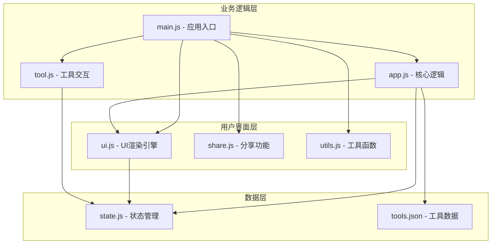

# AI Tool Hub - 代码wiki文档

## 1. 项目概览

AI Tool Hub 是一个现代化的AI工具导航平台，聚合了67款精选AI工具，覆盖10大核心领域，提供7套精美主题。

- **主要功能**：工具导航、分类筛选、搜索、收藏、主题切换、分享功能
- **技术特点**：ES6模块化架构、集中式状态管理、企业级安全防护、极致性能优化
- **应用场景**：开发者、设计师、内容创作者等需要快速找到适合AI工具的用户

## 2. 目录结构

```
ai-tool-hub/
├── index.html              # 主页面 (1400行) - 7套主题CSS + 现代化HTML结构
├── tools.json              # 工具数据 (v2.0, 67个AI工具配置)
├── manifest.json           # PWA清单文件
├── sw.js                   # Service Worker (离线缓存)
├── package.json            # 项目配置和依赖
├── vite.config.js          # Vite构建配置
├── .eslintrc.json          # ESLint配置
├── .gitignore              # Git忽略文件
├── README.md               # 项目说明文档
├── CODE_WIKI.md            # 代码Wiki文档 (本文档)
│
├── js/                     # JavaScript模块 (ES6)
│   ├── state.js            # 📦 集中式状态管理 (120行)
│   ├── app.js              # 🎯 核心逻辑 & 数据加载 (55行)
│   ├── main.js             # 🚀 应用入口 & 初始化 (55行)
│   ├── ui.js               # 🎨 UI渲染引擎 (230行)
│   ├── tool.js             # 🔧 工具交互 (80行)
│   ├── share.js            # 📤 分享功能 (115行)
│   └── utils.js            # 🛠️ 工具函数库 (280行)
│
├── css/                    # CSS样式
│   └── main.css            # 主样式文件
│
├── src/                    # 源代码目录
│   ├── __tests__/          # 测试文件
│   ├── assets/             # 静态资源
│   ├── css/                # 源码样式
│   ├── js/                 # 源码JavaScript
│   ├── types/              # TypeScript类型定义
│   └── index.html          # 源码主页面
│
├── tools/                  # 工具目录
│   └── resume-optimizer/   # 简历优化工具
│
├── v3-dev/                 # v3开发版本
└── .github/workflows/      # CI/CD自动化
    └── deploy.yml          # GitHub Pages部署
```

## 3. 系统架构与主流程

### 3.1 架构设计

AI Tool Hub 采用了模块化的前端架构，基于ES6模块系统构建。核心架构如下：



### 3.2 主流程

1. **应用初始化**：main.js 作为入口，加载主题、工具数据、设置搜索、键盘快捷键等
2. **数据加载**：app.js 从 tools.json 获取工具数据，更新到状态管理
3. **UI渲染**：ui.js 负责渲染分类、热门工具、统计面板和工具卡片
4. **用户交互**：处理搜索、筛选、收藏、分享等用户操作
5. **状态管理**：state.js 集中管理所有状态，包括工具数据、分类、收藏、搜索历史等

## 4. 核心模块详解

### 4.1 状态管理模块 (state.js)

**职责**：集中管理应用状态，避免模块间循环依赖，提供数据操作API。

**核心功能**：
- 全局状态存储（工具、分类、收藏、搜索历史、点击统计、评分）
- 数据操作API（更新数据、获取工具、分类管理）
- 收藏管理（添加/移除收藏）
- 搜索历史管理
- 工具点击统计
- 用户评分管理
- 数据导入/导出

**关键函数**：
- `updateData(tools, categories)`: 更新全局工具和分类数据
- `getTools(category)`: 获取工具列表（可按分类筛选）
- `toggleFavorite(toolId)`: 切换工具收藏状态
- `addToSearchHistory(term)`: 添加搜索词到历史
- `recordToolClick(toolId)`: 记录工具点击统计
- `setToolRating(toolId, rating)`: 设置工具评分
- `exportUserData()`: 导出用户数据
- `importUserData(jsonString)`: 导入用户数据

**安全特性**：
- `safeJsonParse(key, defaultValue)`: 安全解析localStorage中的JSON数据，防止注入

### 4.2 核心逻辑模块 (app.js)

**职责**：负责工具数据的加载和初始化，处理网络请求和错误。

**核心功能**：
- 从 tools.json 加载工具数据
- 验证数据结构
- 更新全局状态
- 动态导入UI模块避免循环依赖
- 渲染UI组件
- 处理加载错误和显示错误状态

**关键函数**：
- `loadTools()`: 异步加载工具数据并初始化UI

### 4.3 UI渲染模块 (ui.js)

**职责**：负责应用的UI渲染，包括分类筛选、工具卡片、搜索功能等。

**核心功能**：
- 渲染分类筛选按钮
- 渲染热门工具 section
- 渲染统计面板
- 生成工具卡片HTML
- 工具网格渲染（使用DocumentFragment优化性能）
- 分类筛选功能
- 搜索功能（带防抖）
- 高级筛选功能
- 排序功能

**关键函数**：
- `renderCategories()`: 渲染分类筛选按钮
- `renderHotTools()`: 渲染热门工具section
- `renderStatisticsDashboard()`: 渲染统计面板
- `createToolCard(tool)`: 创建工具卡片HTML
- `renderTools(tools)`: 渲染工具网格
- `filterCategory(category)`: 按分类筛选工具
- `setupSearch()`: 设置搜索功能
- `applyFiltersAndSort()`: 应用筛选和排序

### 4.4 工具交互模块 (tool.js)

**职责**：处理工具相关的交互操作，如打开工具、收藏、查看详情等。

**核心功能**：
- 打开工具链接（带安全验证）
- 切换收藏状态
- 显示工具详情
- 工具评分

**关键函数**：
- `openTool(toolId, url, event)`: 打开工具链接
- `toggleFavorite(toolId, event)`: 切换收藏状态
- `showToolDetail(toolId)`: 显示工具详情
- `rateTool(toolId, rating)`: 为工具评分

### 4.5 分享功能模块 (share.js)

**职责**：提供工具和页面分享功能，支持多种分享方式。

**核心功能**：
- 显示/关闭分享模态框
- 分享到微信
- 分享到QQ
- 复制分享链接
- 生成分享图片（使用html2canvas）

**关键函数**：
- `showShareModal(toolId)`: 显示分享模态框
- `closeShareModal()`: 关闭分享模态框
- `shareToWeChat()`: 分享到微信
- `shareToQQ()`: 分享到QQ
- `copyShareLink()`: 复制分享链接
- `generateShareImage()`: 生成分享图片

### 4.6 工具函数模块 (utils.js)

**职责**：提供通用工具函数和主题系统。

**核心功能**：
- 安全工具（HTML转义、URL验证）
- 主题系统（7套主题）
- 键盘快捷键
- 下拉刷新（移动端）
- 通知提示（Toast）
- PWA支持（Service Worker注册）
- 公告管理
- 更新检查

**关键函数**：
- `escapeHtml(text)`: 转义HTML特殊字符，防止XSS攻击
- `escapeAttr(text)`: 转义HTML属性特殊字符
- `isValidUrl(url)`: 验证URL安全性，只允许http/https协议
- `setTheme(themeName)`: 设置主题
- `showToast(msg)`: 显示通知提示
- `setupKeyboardShortcuts()`: 设置键盘快捷键
- `setupPullToRefresh()`: 设置下拉刷新（移动端）
- `registerServiceWorker()`: 注册Service Worker

### 4.7 应用入口模块 (main.js)

**职责**：应用的主入口，负责初始化所有模块和功能。

**核心功能**：
- 导入所有模块
- 挂载全局函数到window对象
- 初始化应用
- 底部导航功能
- 排序功能
- 数据导入/导出功能
- 返回顶部按钮

**关键函数**：
- `scrollToTop()`: 滚动到页面顶部
- `showAllTools()`: 显示所有工具
- `changeSort(sortBy)`: 更改排序方式
- `exportFavorites()`: 导出收藏数据
- `importFavorites()`: 导入收藏数据
- `setupBackToTopButton()`: 设置返回顶部按钮

## 5. 核心 API/类/函数

### 5.1 状态管理 API

| 函数名 | 描述 | 参数 | 返回值 | 所属文件 |
|--------|------|------|--------|----------|
| `updateData` | 更新全局工具和分类数据 | tools: Array 工具数组<br>categories: Array 分类数组 | 无 | [state.js](file:///Users/weijiahao/Downloads/ai-tool-hub/js/state.js) |
| `getTools` | 获取工具列表（可按分类筛选） | category: string 分类ID（可选） | Array 工具数组 | [state.js](file:///Users/weijiahao/Downloads/ai-tool-hub/js/state.js) |
| `getCategoryName` | 根据分类ID获取分类名称 | categoryId: string 分类ID | string 分类名称 | [state.js](file:///Users/weijiahao/Downloads/ai-tool-hub/js/state.js) |
| `isFavorite` | 检查工具是否被收藏 | toolId: number 工具ID | boolean 是否收藏 | [state.js](file:///Users/weijiahao/Downloads/ai-tool-hub/js/state.js) |
| `toggleFavorite` | 切换工具收藏状态 | toolId: number 工具ID | boolean 新的收藏状态 | [state.js](file:///Users/weijiahao/Downloads/ai-tool-hub/js/state.js) |
| `addToSearchHistory` | 添加搜索词到历史 | term: string 搜索词 | 无 | [state.js](file:///Users/weijiahao/Downloads/ai-tool-hub/js/state.js) |
| `recordToolClick` | 记录工具点击统计 | toolId: number 工具ID | 无 | [state.js](file:///Users/weijiahao/Downloads/ai-tool-hub/js/state.js) |
| `setToolRating` | 设置工具评分 | toolId: number 工具ID<br>rating: number 评分(1-5) | number 设置的评分 | [state.js](file:///Users/weijiahao/Downloads/ai-tool-hub/js/state.js) |
| `exportUserData` | 导出用户数据 | 无 | string JSON格式的用户数据 | [state.js](file:///Users/weijiahao/Downloads/ai-tool-hub/js/state.js) |
| `importUserData` | 导入用户数据 | jsonString: string JSON格式的用户数据 | Object 导入结果 | [state.js](file:///Users/weijiahao/Downloads/ai-tool-hub/js/state.js) |

### 5.2 UI 渲染 API

| 函数名 | 描述 | 参数 | 返回值 | 所属文件 |
|--------|------|------|--------|----------|
| `renderCategories` | 渲染分类筛选按钮 | 无 | 无 | [ui.js](file:///Users/weijiahao/Downloads/ai-tool-hub/js/ui.js) |
| `renderHotTools` | 渲染热门工具section | 无 | 无 | [ui.js](file:///Users/weijiahao/Downloads/ai-tool-hub/js/ui.js) |
| `renderStatisticsDashboard` | 渲染统计面板 | 无 | 无 | [ui.js](file:///Users/weijiahao/Downloads/ai-tool-hub/js/ui.js) |
| `createToolCard` | 创建工具卡片HTML | tool: Object 工具对象 | string HTML字符串 | [ui.js](file:///Users/weijiahao/Downloads/ai-tool-hub/js/ui.js) |
| `renderTools` | 渲染工具网格 | tools: Array 工具数组 | 无 | [ui.js](file:///Users/weijiahao/Downloads/ai-tool-hub/js/ui.js) |
| `filterCategory` | 按分类筛选工具 | category: string 分类ID | 无 | [ui.js](file:///Users/weijiahao/Downloads/ai-tool-hub/js/ui.js) |
| `setupSearch` | 设置搜索功能 | 无 | 无 | [ui.js](file:///Users/weijiahao/Downloads/ai-tool-hub/js/ui.js) |
| `applyFiltersAndSort` | 应用筛选和排序 | 无 | 无 | [ui.js](file:///Users/weijiahao/Downloads/ai-tool-hub/js/ui.js) |

### 5.3 工具交互 API

| 函数名 | 描述 | 参数 | 返回值 | 所属文件 |
|--------|------|------|--------|----------|
| `openTool` | 打开工具链接 | toolId: number 工具ID<br>url: string 工具URL<br>event: Event 点击事件 | 无 | [tool.js](file:///Users/weijiahao/Downloads/ai-tool-hub/js/tool.js) |
| `toggleFavorite` | 切换工具收藏状态 | toolId: number 工具ID<br>event: Event 点击事件 | 无 | [tool.js](file:///Users/weijiahao/Downloads/ai-tool-hub/js/tool.js) |
| `showToolDetail` | 显示工具详情 | toolId: number 工具ID | 无 | [tool.js](file:///Users/weijiahao/Downloads/ai-tool-hub/js/tool.js) |
| `rateTool` | 为工具评分 | toolId: number 工具ID<br>rating: number 评分(1-5) | 无 | [tool.js](file:///Users/weijiahao/Downloads/ai-tool-hub/js/tool.js) |

### 5.4 工具函数 API

| 函数名 | 描述 | 参数 | 返回值 | 所属文件 |
|--------|------|------|--------|----------|
| `escapeHtml` | 转义HTML特殊字符 | text: any 待转义文本 | string 转义后的文本 | [utils.js](file:///Users/weijiahao/Downloads/ai-tool-hub/js/utils.js) |
| `escapeAttr` | 转义HTML属性特殊字符 | text: any 待转义文本 | string 转义后的文本 | [utils.js](file:///Users/weijiahao/Downloads/ai-tool-hub/js/utils.js) |
| `isValidUrl` | 验证URL安全性 | url: string 待验证URL | boolean 是否安全 | [utils.js](file:///Users/weijiahao/Downloads/ai-tool-hub/js/utils.js) |
| `setTheme` | 设置主题 | themeName: string 主题名称 | 无 | [utils.js](file:///Users/weijiahao/Downloads/ai-tool-hub/js/utils.js) |
| `showToast` | 显示通知提示 | msg: string 提示信息 | 无 | [utils.js](file:///Users/weijiahao/Downloads/ai-tool-hub/js/utils.js) |
| `setupKeyboardShortcuts` | 设置键盘快捷键 | 无 | 无 | [utils.js](file:///Users/weijiahao/Downloads/ai-tool-hub/js/utils.js) |
| `registerServiceWorker` | 注册Service Worker | 无 | 无 | [utils.js](file:///Users/weijiahao/Downloads/ai-tool-hub/js/utils.js) |

## 6. 技术栈与依赖

### 6.1 前端技术

| 技术 | 版本 | 用途 | 所属文件 |
|------|------|------|----------|
| HTML5 | - | 语义化标签、ARIA无障碍、data-theme属性 | [index.html](file:///Users/weijiahao/Downloads/ai-tool-hub/index.html) |
| CSS3 | - | CSS变量、Flexbox/Grid布局、动画、渐变、backdrop-filter | [css/main.css](file:///Users/weijiahao/Downloads/ai-tool-hub/css/main.css) |
| JavaScript ES6+ | - | 模块化(import/export)、Async/Await、模板字符串、解构赋值 | [js/](file:///Users/weijiahao/Downloads/ai-tool-hub/js/) |
| Font Awesome | 6.4.0 | 图标库（6000+图标） | [index.html](file:///Users/weijiahao/Downloads/ai-tool-hub/index.html) |
| html2canvas | 1.4.1 | 截图分享功能 | [share.js](file:///Users/weijiahao/Downloads/ai-tool-hub/js/share.js) |

### 6.2 开发工具

| 工具 | 版本 | 用途 | 所属文件 |
|------|------|------|----------|
| Vite | ^5.0.0 | 构建工具、开发服务器 | [package.json](file:///Users/weijiahao/Downloads/ai-tool-hub/package.json) |
| ESLint | ^8.55.0 | 代码质量检查 | [package.json](file:///Users/weijiahao/Downloads/ai-tool-hub/package.json) |
| Prettier | ^3.1.0 | 代码格式化 | [package.json](file:///Users/weijiahao/Downloads/ai-tool-hub/package.json) |
| Jest | ^29.7.0 | 单元测试 | [package.json](file:///Users/weijiahao/Downloads/ai-tool-hub/package.json) |
| gh-pages | ^6.3.0 | GitHub Pages部署 | [package.json](file:///Users/weijiahao/Downloads/ai-tool-hub/package.json) |
| TypeScript | ^5.3.0 | 类型定义 | [package.json](file:///Users/weijiahao/Downloads/ai-tool-hub/package.json) |

## 7. 关键模块与典型用例

### 7.1 主题系统

**功能说明**：提供7套精美主题，支持即时切换和自动保存。

**配置与依赖**：
- CSS变量定义在index.html的style标签中
- 主题配置在utils.js的THEMES对象中

**使用示例**：

```javascript
// 切换到深夜模式
setTheme('midnight');

// 切换到海洋蓝主题
setTheme('ocean');

// 查看当前主题
console.log(currentTheme); // 输出当前主题名称
```

### 7.2 搜索功能

**功能说明**：支持工具名称和描述的模糊搜索，带防抖优化和搜索历史。

**配置与依赖**：
- 搜索防抖时间：300ms (SEARCH_DEBOUNCE_TIME)
- 搜索历史最大长度：10 (MAX_SEARCH_HISTORY)

**使用示例**：

```javascript
// 在搜索框中输入关键词
// 搜索会自动触发，带300ms防抖

// 清除搜索
clearSearch();

// 设置搜索词
setSearch('ChatGPT');
```

### 7.3 收藏系统

**功能说明**：允许用户收藏常用工具，数据保存在localStorage中。

**配置与依赖**：
- 收藏数据存储在localStorage的'ai-tool-hub-favorites'键中

**使用示例**：

```javascript
// 切换工具收藏状态
toggleFavorite(1); // 1是工具ID

// 检查工具是否被收藏
const isFav = isFavorite(1);
console.log(`工具1是否被收藏: ${isFav}`);
```

### 7.4 分享功能

**功能说明**：支持多种分享方式，包括微信、QQ、复制链接和生成图片。

**配置与依赖**：
- 依赖html2canvas库生成分享图片

**使用示例**：

```javascript
// 显示分享模态框
showShareModal(1); // 1是工具ID

// 复制分享链接
copyShareLink();

// 生成分享图片
generateShareImage();
```

## 8. 配置、部署与开发

### 8.1 本地开发

**方式一：直接部署**

```bash
# 克隆仓库
git clone https://github.com/a895411690/ai-tool-hub.git
cd ai-tool-hub

# 启动本地服务器
# Python 3
python3 -m http.server 9008

# 或使用 Node.js
npx serve .

# 或 PHP
php -S localhost:9008

# 访问应用
# http://localhost:9008
```

**方式二：Vite开发模式**

```bash
# 安装依赖
npm install

# 启动开发服务器 (热更新)
npm run dev

# 生产构建 (代码压缩+优化)
npm run build

# 预览生产构建
npm run preview
```

### 8.2 部署

**GitHub Pages部署**

```bash
# 构建项目
npm run build

# 部署到GitHub Pages
npm run deploy
```

### 8.3 配置文件

| 配置文件 | 用途 | 路径 |
|---------|------|------|
| tools.json | 工具数据配置 | [tools.json](file:///Users/weijiahao/Downloads/ai-tool-hub/tools.json) |
| manifest.json | PWA配置 | [manifest.json](file:///Users/weijiahao/Downloads/ai-tool-hub/manifest.json) |
| sw.js | Service Worker | [sw.js](file:///Users/weijiahao/Downloads/ai-tool-hub/sw.js) |
| vite.config.js | Vite构建配置 | [vite.config.js](file:///Users/weijiahao/Downloads/ai-tool-hub/vite.config.js) |

## 9. 监控与维护

### 9.1 错误处理

- **网络错误**：加载工具数据失败时显示错误提示和重试按钮
- **数据解析错误**：使用safeJsonParse函数处理localStorage数据解析错误
- **URL验证**：所有工具链接都经过isValidUrl验证，只允许http/https协议

### 9.2 性能优化

- **搜索防抖**：300ms防抖减少无效计算
- **DOM操作优化**：使用DocumentFragment批量插入节点，减少页面重排
- **localStorage写入防抖**：减少存储操作次数
- **首屏加载优化**：代码精简+模块懒加载

### 9.3 安全防护

- **XSS防护**：escapeHtml() + escapeAttr() 双重转义机制
- **URL安全验证**：仅允许 http/https 协议，防止 javascript: 注入
- **输入净化**：所有动态内容经过严格转义处理
- **安全解析**：safeJsonParse() 防止JSON注入和原型链污染
- **CSP兼容**：无内联事件处理器安全隐患

## 10. 总结与亮点回顾

AI Tool Hub 是一个功能丰富、性能优异的AI工具导航平台，具有以下核心亮点：

- **现代化UI设计**：7套精美主题，响应式布局，丰富的微交互动画
- **强大的状态管理**：集中式状态管理，消除循环依赖，提供完整的数据操作API
- **企业级安全防护**：多重安全措施，防止XSS攻击和注入
- **极致性能优化**：搜索防抖、DOM操作优化、localStorage写入防抖等
- **丰富的功能**：67款AI工具，10大分类，搜索、筛选、收藏、分享等功能
- **良好的可维护性**：模块化架构，100% JSDoc覆盖，零重复代码
- **PWA支持**：离线缓存，提升用户体验

项目采用ES6模块化架构，使用Vite作为构建工具，代码质量高，性能优异，是一个值得学习的前端项目范例。

## 11. 附录

### 11.1 工具分类列表

| 分类 | 工具数量 | 描述 |
|------|----------|------|
| AI写作 | 9款 | ChatGPT、Claude、Kimi、文心一言等 |
| AI绘画 | 7款 | Midjourney、Stable Diffusion、DALL·E 3等 |
| AI代码 | 9款 | GitHub Copilot、Cursor、CodeGeeX等 |
| AI视频 | 7款 | Runway Gen-2、HeyGen、剪映AI等 |
| AI语音 | 8款 | ElevenLabs、Murf AI、讯飞配音等 |
| AI设计 | 5款 | Figma AI、MasterGo AI、即时设计等 |
| AI办公 | 8款 | Notion AI、WPS AI、飞书AI等 |
| AI音乐 | 5款 | Suno AI、Udio、网易天音等 |
| AI智能体 | 5款 | Coze、Dify、FastGPT等 |
| AI搜索 | 4款 | Perplexity AI、秘塔AI搜索、You.com等 |

### 11.2 主题列表

| 主题 | 描述 | 主色调 |
|------|------|--------|
| 默认紫蓝 | 经典渐变，日常首选 | `#6366f1 → #ec4899` |
| 深夜模式 | 护眼暗色，夜间阅读 | `#1a1a2e` (深色) |
| 薰衣草紫 | 温柔优雅，浪漫氛围 | `#a78bfa` (淡紫) |
| 海洋蓝 | 清新自然，舒适宜人 | `#0ea5e9` (天蓝) |
| 樱花粉 | 浪漫甜美，少女心 | `#ec4899` (粉红) |
| 森林绿 | 自然护眼，生机勃勃 | `#059669` (翠绿) |
| 日落橙 | 活力热情，温暖阳光 | `#ea580c` (橙色) |

### 11.3 键盘快捷键

| 快捷键 | 功能 |
|--------|------|
| `/` 或 `S` | 聚焦搜索框 |
| `Escape` | 清除搜索，关闭弹窗 |

### 11.4 性能指标

| 指标 | 数值 | 评级 |
|------|------|------|
| 首屏加载时间 | < 1s | 🟢 优秀 |
| Lighthouse Performance | > 90分 | 🟢 优秀 |
| Bundle Size (gzipped) | < 40KB | 🟢 优秀 |
| DOM节点数 | < 500 | 🟢 优秀 |
| 渲染阻塞资源 | 0 | 🟢 优秀 |

### 11.5 代码质量指标

| 指标 | 数值 | 评级 |
|------|------|------|
| JSDoc覆盖率 | 100% | 🟢 完整 |
| 循环复杂度 | < 10/函数 | 🟢 低耦合 |
| 代码重复率 | 0% | 🟢 DRY原则 |
| 全局变量数 | 16个 | 🟢 最小化 |
| 模块数量 | 7个 | 🟢 高内聚低耦合 |
